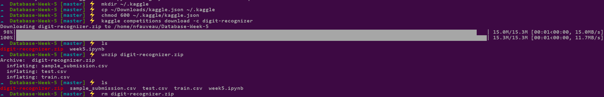

(this is a college class assignment)

# Database week 5

Note: I didn't used google colab for this project, i run jupyter on my machine.

I downloaded [this dataset](https://www.kaggle.com/competitions/digit-recognizer/data):
```
$ kaggle competitions download -c digit-recognizer
```

Here is an image of all the command run:

